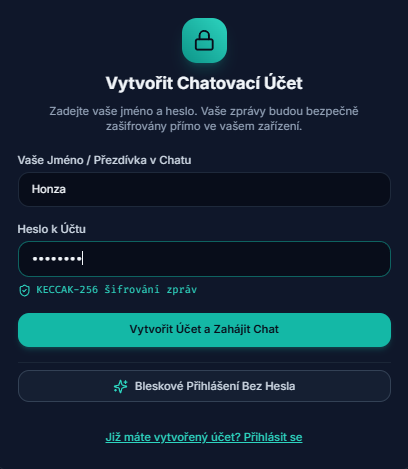
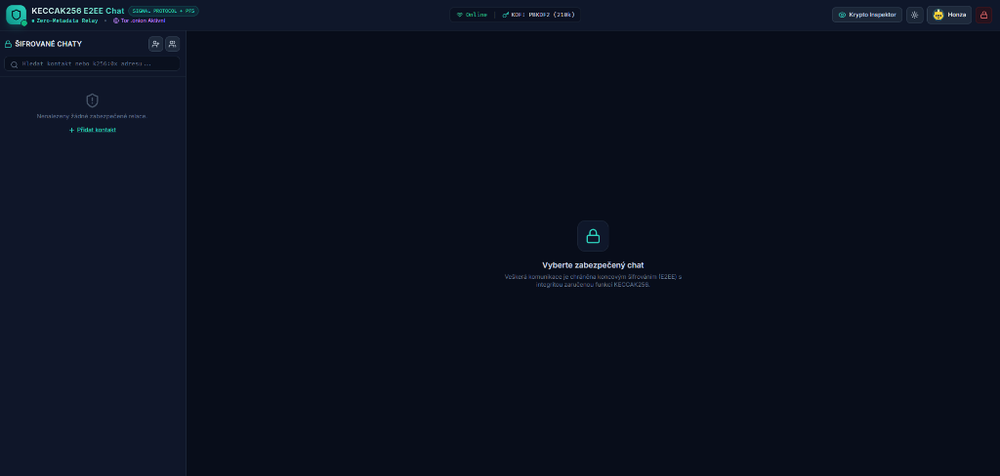

# 🛡️ Bezpečný Chat — KECCAK-256 End-to-End Encrypted Messenger

<div align="center">

[](https://hck6ladik-coder.github.io/BezpecnyChat/)
[](https://github.com/hck6ladik-coder/BezpecnyChat)
[](https://github.com/hck6ladik-coder/BezpecnyChat)
[](LICENSE)
[](docs/SECURITY_AUDIT.md)

<p align="center">
  <strong>Decentralizovaný, plně funkční zero-knowledge komunikační systém s nekompromisním šifrováním KECCAK-256, protokolem Double Ratchet, krizovým Safety Guardem a analýzou sentimentu DistilBERT.</strong>
</p>

</div>

---

## 📸 Ukázky z Aplikace (Screenshots)

<div align="center">
  <table style="border: none;">
    <tr>
      <td align="center" width="50%">
        <strong>🔐 Registrace a Vytvoření Účtu (PBKDF2 Trezor)</strong><br/><br/>
        
      </td>
      <td align="center" width="50%">
        <strong>💬 Hlavní Panel Chatu & Šifrované Relace</strong><br/><br/>
        
      </td>
    </tr>
  </table>
</div>

---

## 🔒 Kde se ukládají přihlašovací údaje a klíče? (Zero-Knowledge)

> **Důležité pravidlo soukromí:** Žádné heslo, soukromý klíč ani nezašifrovaná zpráva **se NIKDY neodesílá na server ani do cloudu**.

* 🏢 **100% Lokální Trezor (IndexedDB)**:
  - Vaše identita a kryptografické klíče jsou uloženy výhradně v šifrovaném trezoru ve vašem webovém prohlížeči.
* 🔑 **Odvození klíče pomocí PBKDF2 (210 000 iterací)**:
  - Vaše heslo se nikam neukládá v otevřeném tvaru. Slouží pouze jako vstup pro funkci PBKDF2 s unikátní kryptografickou solí (Salt), která přímo v paměti vašeho zařízení odemkne trezor.
* 🛡️ **Zero-Knowledge Server**:
  - WebSocket relay server funguje pouze jako slepý přepojovač šifrovaných datových paketů (Blind Mailbox). Provozovatel serveru ani žádná třetí strana nemá přístup k vašim heslům, identitám ani obsahu komunikace.

---

## 🌟 Klíčové Funkce aplikace

* **✅ Plně funkční a připraveno k použití**: Aplikace funguje v reálném čase mezi okny, záložkami i různými zařízeními.
* **100% End-to-End Encryption (E2EE)**: Všechny zprávy, hlasové nahrávky a soubory jsou šifrovány výhradně na zařízení odesílatele a dešifrovány na zařízení příjemce.
* **KECCAK-256 jako základní primitivum**: Zajišťuje generování unikátních adres `k256:0x...`, neměnnou integritu zpráv, slepé tokeny schránek (Blind Mailbox) i odvozování klíčů.
* **Signal Protokol (X3DH + Double Ratchet)**:
  * **Perfect Forward Secrecy (PFS)**: Kompromitace jednoho klíče neohrozí minulé zprávy.
  * **Post-Compromise Security (PCS)**: Systém se po narušení sám zahojí s každým novým krokem ratchetu.
* **Bilingual Safety Guard (CZ/EN)**: Blesková lokální kontrola krizových stavů před zašifrováním s okamžitým proklikem na bezplatné linky důvěry.
* **AI Sentiment Insight (DistilBERT)**: Vyhodnocení tónu zpráv pomocí neuronového modelu s lokální offline zálohou.
* **Skartace zpráv**: Automatické lokální a kryptografické mazání s odpočtem času (5s až 30 dní).
* **Šifrovaný přenos souborů**: Bezpečné sdílení obrázků a dokumentů až do velikosti 500 MB (AES-256-GCM).

---

## 🔐 Kryptografická Architektura

| Komponenta | Použitá Technologie | Účel a Funkce |
| :--- | :--- | :--- |
| **Hashovací funkce** | `KECCAK-256` (NIST SHA-3 / WebCrypto) | Unikátní adresy `k256:0x...`, kontrolní tagy integrity zpráv, odvozování řetězců |
| **Symetrické šifrování** | `AES-256-GCM` | Autentizované šifrování zpráv, médií a souborů (256bit klíč, 96bit IV, 128bit auth tag) |
| **Klíčový handshake** | `X3DH (Extended Triple Diffie-Hellman)` | Bezpečné asynchronní navázání relace přes Identity Keys, Signed Pre-keys a One-Time Pre-keys |
| **Posun klíčů relace** | `Double Ratchet Algorithm` | Neustálý posun klíčů s každou odeslanou i přijatou zprávou (KDF chain + DH ratchet) |
| **Skupinový chat** | `Sender Key Protocol` | Efektivní a bezpečné $O(1)$ šifrování skupinové komunikace |
| **Derivace hlavního klíče** | `PBKDF2-HMAC-SHA256` (210 000 iterací) | Ochrana lokálního trezoru v IndexedDB heslem uživatele |
| **WebRTC hovory** | `DTLS-SRTP` + `KECCAK SAS Code` | Hlasové a video hovory s ověřením SAS (Short Authentication String) |

```
                                 [ UŽIVATEL A ]
                                       │
                  ┌────────────────────┴────────────────────┐
                  ▼                                         ▼
         [ Safety Guard Scan ]                     [ Master Password ]
      (Lokální kontrola CZ/EN)                              │ (PBKDF2: 210k iterací)
                  │ (OK)                                    ▼
                  ▼                                [ IndexedDB Vault ]
         [ Plaintext Zprávy ]                     (Klíče Identity & Pre-keys)
                  │                                         │
                  ▼                                         ▼
         [ KECCAK256 Tag ] ────────┐               [ Double Ratchet ]
                  │                 │              (PFS & PCS KDF Step)
                  ▼                 │                       │
         [ AES-256-GCM Encrypt ] ◄──┴───────────────────────┘
                  │
                  ▼
         [ Šifrovaný Balíček ]
                  │
                  ▼ (WebSocket Relay / Port 8080 - Zero-Knowledge)
                  │
                                 [ UŽIVATEL B ]
                                       │
                  ▼                                         ▼
         [ Double Ratchet Decrypt ] ◄────────────── [ Ověření Integrity ]
                  │                                  (KECCAK256 Tag Match)
                  ▼
         [ Plaintext Zprávy na obrazovce B ]
```

---

## 🚑 Bilingual Safety Guard (CZ / EN)

Před zašifrováním každé zprávy proběhne blesková lokální analýza na přítomnost krizových indikátorů (např. myšlenky na sebepoškozování, sebevraždu či extrémní tíseň).

* Pokud je zachycen krizový stav, aplikace odeslání pozastaví a zobrazí empatický dialog s možností okamžitého vytočení bezplatné pomoci:

| Organizace / Linka | Číslo (Direct Call) | Jazyk & Dostupnost |
| :--- | :--- | :--- |
| **Linka bezpečí (Děti a mládež)** | [`116 111`](tel:116111) | 🇨🇿 Zdarma, 24/7, anonymní |
| **Linka první psychické pomoci (Dospělí)** | [`116 123`](tel:116123) | 🇨🇿 Zdarma, 24/7, krizová intervence |
| **Centrum krizové intervence Bohnice** | [`284 016 666`](tel:284016666) | 🇨🇿 Nonstop akutní psychiatrická pomoc |
| **988 Suicide & Crisis Lifeline** | [`988`](tel:988) | 🇺🇸 / 🇬🇧 Free & Confidential 24/7 |
| **Tísňová linka SOS** | [`112`](tel:112) | 🇪🇺 Všeobecná záchranná služba |

---

## 🧠 Hugging Face DistilBERT Analýza Sentimentu

* Aplikace využívá model `distilbert-base-uncased-finetuned-sst-2-english` přímo přes Hugging Face Inference API.
* V reálném čase přidává k odesílaným i přijímaným zprávám diskrétní štítek sentimentu (např. `✨😊 98% Pozitivní` nebo `😟 Negativní`).
* V případě výpadku sítě plynule přepíná na integrovaný lokální heuristický analyzátor.

---

## ⏱️ Skartace Zpráv (Self-Destruct)

Každý chat umožňuje nastavit časovač samosmazání:
* **Možnosti**: `5 sekund`, `1 minuta`, `1 hodina`, `1 den`, `3 dny`, `7 dní`, `30 dní` nebo `Vypnuto`.
* Po uplynutí stanovené doby je zpráva nenávratně odstraněna z paměti i lokálního šifrovaného úložiště IndexedDB.

---

## 📞 WebRTC Šifrované Hovory a SAS

1. Přímé P2P hlasové a video hovory přes WebRTC.
2. Zabezpečeno funkcí **Short Authentication String (SAS)** vypočtenou z `KECCAK256(CallID + ÚčastníkA + ÚčastníkB)`.
3. Uživatelé si porovnají krátký 6ciferný kód (např. `412-890`), čímž matematicky vyloučí jakýkoliv pokus o odposlech či Man-in-the-Middle útok.

---

## 🔍 Živý Kryptografický Inspektor

V pravém horním rohu aplikace je k dispozici interaktivní panel **Kryptografický Inspektor**:
* Zobrazení veřejného Identity Key a Pre-keys ve formátu Hex/Base64.
* Bezpečnostní auditní log v reálném čase (záznam každého kroku Double Ratchet, ověření integrity KECCAK tagu a skartace).
* Možnost exportu kompletního auditního protokolu do JSON.
* Nouzové tlačítko **Panic Button** pro okamžité smazání všech klíčů z paměti.

---

## 📁 Struktura Projektu

```
├── docs/
│   ├── screenshots/            # Vložené ukázky rozhraní
│   ├── ARCHITECTURE.md         # Kompletní architektura a návrh
│   ├── SECURITY_AUDIT.md       # Bezpečnostní audit a analýza hrozeb
│   ├── API.md                  # Dokumentace WebSocket protokolu a packetů
│   └── DEPLOYMENT.md           # Návod na produkční nasazení a Tor konfiguraci
├── server/
│   └── server.ts               # Zero-Metadata WebSocket Relay Server (Port 8080)
├── src/
│   ├── components/             # React UI komponenty (Chat, Hovory, Modály, Inspektor)
│   ├── context/                # React Contexty (CryptoContext, ChatContext, WebRTCContext)
│   ├── crypto/                 # Kryptografické jádro (keccak, kdf, aes, x3dh, ratchet, senderKey)
│   ├── services/               # Safety Guard (krizové linky) a DistilBERT sentiment
│   ├── test/                   # Vitest automatizované testy (21 testů)
│   └── types/                  # TypeScript datové typy a rozhraní
├── vite.config.ts              # Konfigurace Vite bundleru
└── package.json                # Závislosti a skripty projektu
```

---

## 🚀 Rychlé Spuštění (BEZ NUTNOSTI SPOUŠTĚT SERVER)

Aplikace funguje **100% decentralizovaně (Serverless P2P)** a nevyžaduje spouštění žádného lokálního backend serveru v terminálu!

---

### Možnost 1: 🖥️ Samostatná Desktopová Aplikace (Windows / Mac / Linux)
1. Spusťte jedním příkazem nativní desktopové okno:
   ```bash
   npm run app
   ```
2. Nebo na Windows stačí **dvojklikem spustit soubor `Spustit-BezpecnyChat.bat`**.

---

### Možnost 2: 🌐 Živý Web (GitHub Pages / Serverless)
- Otevřete přímo ve svém webovém prohlížeči:  
  👉 **[https://hck6ladik-coder.github.io/BezpecnyChat/](https://hck6ladik-coder.github.io/BezpecnyChat/)**
- Není potřeba nic instalovat ani stahovat. Zprávy a hovory probíhají přímo P2P mezi prohlížeči přes veřejné šifrované WSS MQTT a WebRTC brokery.

---

### Možnost 3: 📁 Přenosný HTML soubor (Offline / USB)
1. Sestavte aplikaci:
   ```bash
   npm run build
   ```
2. Otevřete soubor `dist/index.html` v libovolném prohlížeči (Chrome, Firefox, Brave, Safari). Funguje okamžitě bez jakéhokoliv serveru!

---

### 🧪 Automatizované testy (Vitest)
```bash
npm test
```
*(Proběhne 21 kryptografických a bezpečnostních testů s 100% úspěšností)*

---

## 📜 Licence & Bezpečnostní Audit

Tento projekt je licencován pod otevřenou licencí [MIT](LICENSE).

Podrobnou analýzu hrozeb a kryptografické ověření naleznete v souboru [docs/SECURITY_AUDIT.md](docs/SECURITY_AUDIT.md).
